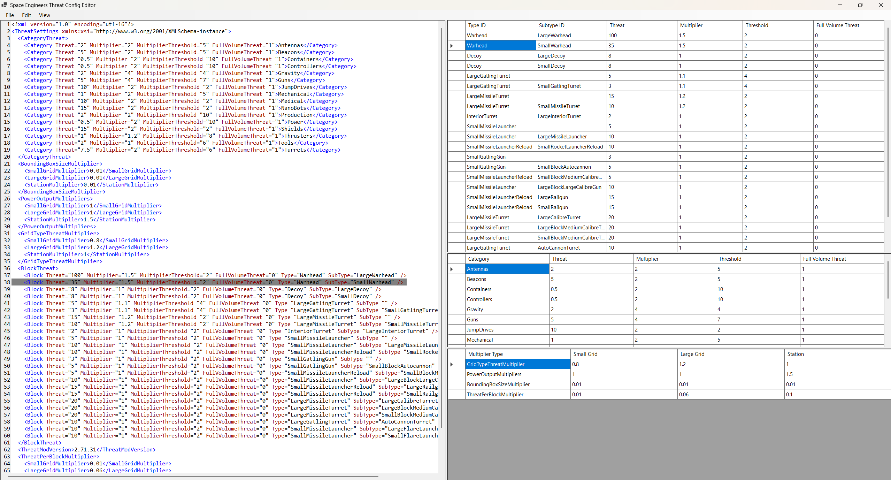
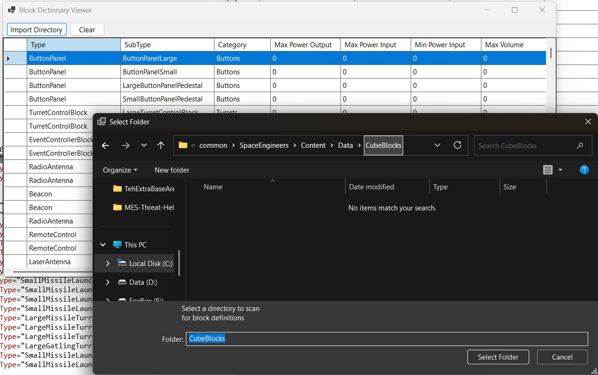

# MES Threat Helper

### A companion application for a special version of the Modular Encounters System mod/plugin for Space Engineers.  

Hi there. I replaced the threat system in Modular Encounters System in order to support more customization.  
It is now **very** customizable.  
In fact, It is **too** customizable to do by hand. 
 
 #### So I made you this GUI based application to help you create your threat settings .XML for Modular Encounter Systems:
 
   
 
    
  
 It does a lot. There are a lot of undocumented features. In fact, they are all undocumented.  
 You might have to ask me on discord for a while until I make some.  
   
 ### Lazy List of features
 * Realtime updates to your file through the table.
 * Add new blocks by dragging a SBC file containing them onto the text editor.
 * Remove them by selecting the row on the table before deleting. You may also delete the line from the text editor.
 * Scan your installation's blocks into a block dictionary by pointing it to the folder that contains the definition.
 * Use this dictionary to preview threat profiles for blueprints and prefabs you can import into the program.
 
 
 ### WARNING: NO WARRANTY OR GUARENTEED SUPPORT
 Save your work. This application is like a helicopter - constantly and desperately trying to tear itself apart while somehow working to carry a few thousand pounds through the air.
 